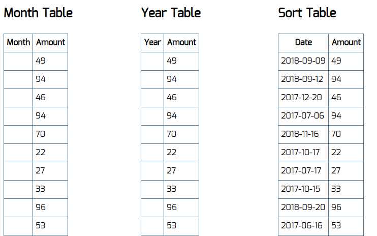

# HOC — Higher Order Components

<!-- [](https://ci.appveyor.com/project/RomanMenshikov92/ra-16-react-HOC-higher-order-components) -->

<!-- [](https://github.com/RomanMenshikov92/ra-16-react-HOC-higher-order-components/actions/workflows/pages/pages-build-deployment) -->

---

<!-- ## [GutHub Pages](https://romanmenshikov92.github.io/ra-16-react-HOC-higher-order-components/) -->

Необходимо выполнить и предоставить на проверку следующие задачи:

<details>
<summary>1. Форматирование даты публикации</summary>

# Форматирование даты публикации

Есть страница, содержащая список видеозаписей.
У каждого блока есть дата публикации.


В данный момент выводится просто текущее значение. Пример: `2017-09-01 14:15:10`.
Решено изменять представление даты следующим образом в зависимости от его значения:
`12 минут назад`, если прошло меньше часа, `5 часов назад`, если прошло больше часа, `X дней назад`, если больше суток.

## Реализация

Используя HOC, обернуть `DateTime` в компонент `DateTimePretty` так, чтобы он преобразовывал дату в нужный вид.

Воспользуйтесь готовым файлом `App.js` и стилями `css/index.css` из каталога в качестве отправной точки. Замените ими те, что создаются в create-react-app.

Для работы с датой и временем можете воспользоваться библиотекой Moment.js.

</details>

<details>
<summary>2. Популярное и новое</summary>

# Подсвечивание блоков

На нашем сайте есть блоки со статьями и с видеозаписями.


Мы решили улучшить отображение наших блоков таким образом, чтобы популярные статьи и видео, у которых 1000+ прочтений или просмотров,
оборачивались в компонент `Popular`, а с количеством до 100 — в компонент `New`. Эти компоненты будут менять внешний облик блоков, привлекая внимание посетителей.

## Реализация

Используя HOC, обернуть `Video` и `Article` таким образом, чтобы при отображении в компоненте `List` они помещались внутрь требуемого компонента `Popular` или `New`.

Воспользуйтесь готовым файлом `App.js` и стилями `css/index.css` из каталога в качестве отправной точки. Замените ими те, что создаются в create-react-app.

</details>

<details>
<summary>3. Агрегация данных (необязательная задача)</summary>

# Агрегация данных для таблиц

Есть набор из трёх компонентов, которые выводят табличные данные:

- с группировкой по месяцам за текущий год,
- с группировкой по годам,
- с сортировкой по убыванию.



К сожалению, эти компоненты работают только с подготовленными данными, а API сервера статистики возвращает нам сырые данные — неотсортированные и несгруппированные.

Данные запрашиваются один раз (https://raw.githubusercontent.com/netology-code/ra16-homeworks/master/hoc/aggregation/data/data.json) — после загрузки страницы.

```js
{
  "list": [
    {"date": "2018-01-13", "amount": 10},
    {"date": "2018-02-13", "amount": 9},
    {"date": "2018-01-09", "amount": 5},
    {"date": "2017-12-14", "amount": 14},
    {"date": "2018-03-01", "amount": 13},
    //...
  ]
}
```

## Реализация

Обернуть компоненты таблиц в HOC, который бы производил над данными операции, приводящие их к нужному виду.
Также данные, которые группируются по дате, должны быть отсортированы по ней.

Компонент `MonthTable` ожидает данные в свойство `list` в следующем формате:

```js
[{month: "Jan", amount: 100}, ...]
```

Компонент `YearTable` ожидает данные в свойство `list` в следующем формате:

```js
[{year: 2018, amount: 100}, ...]
```

Компонент `SortTable` ожидает данные в свойство `list` в следующем формате:

```js
[{date: "2017-12-14", amount: 14}, ...]
```

Воспользуйтесь готовым файлом `App.js` и стилями `css/index.css` из каталога в качестве отправной точки. Замените ими те, что создаются в create-react-app.

</details>
</br>

---

Любые вопросы по решению задач задавайте в группе в Discord.

Все три задачи лучше сдавать в разных репозиториях, то есть через create-react-app реализовать три проекта, чтобы не было конфликта стилей. Но если вы позаботитесь о том, что конфликта не будет, то можете сдавать и в одном проекте.

Обратите внимание: в файлах App.js расположено несколько компонентов не потому, что так нужно делать, а чтобы вам было удобнее копировать. Будет хорошо, если в своём решении вы разнесёте их по разным файлам.

#### Альтернативный способ создания приложения React с использованием тулинга Vite

Приложение также можно создать используя инструмент Vite.
Документация по созданию приложения [React](https://vitejs.dev/guide/).

1. Откройте терминал и пропишите следующую команду: `yarn create vite my-app --template react`,
   либо `yarn create vite my-app --template react-ts`, если
   нужен шаблон с TypeScript. Эта команда создаст настроенный
   шаблонный проект.
2. Откройте созданный проект в своей IDE.
3. Установите зависимости.
4. Готово. Чтобы запустить приложение, введите команду: `yarn dev`(либо `npm run dev`).
